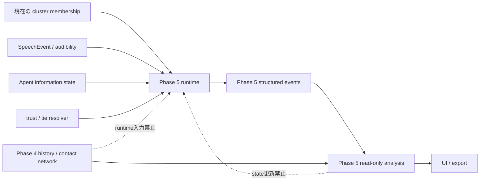

# 話題・情報・口コミ伝播のドメイン契約 (Issue #228, standing-party Phase 5 設計)

Parent Roadmap: #172。Depends on: #211〜#218。Blocks: #229〜#235。

この文書は、立食パーティー(`standingParty`)へ Topic、Claim、内容発話、受信・採用・記憶、
再伝達・変容を追加するための**ドメイン契約(ADR)**である。本Issueの成果物は設計文書のみであり、
`SpeechEvent`、`SimulationState`、`stepSimulation`、既存の状態・event・PRNG消費順は変更しない。
型とruntimeの実装は #229 以降が本契約に従って段階的に行う。

> **Phase名の注意**: 本文書の Phase 5 は Roadmap #172 の「話題・情報伝播・口コミ変容」を指す。
> Roadmap #61 の speech Phase 3/4(`speechEffects` / `socialExpression` / `speechTrust` /
> `relationshipTie`)とは別の番号体系である。

---

## 0. 決定要約

1. `SpeechIntent`は「誘う・歓迎する等の社会的行為」、Topic / Claim / Variantは「伝える内容」とし、
   同じenumへ混ぜない。
2. 内容発話は`ContentUtteranceEvent`というsidecar eventにし、必ず1件の`SpeechEvent`を
   `speechEventId`で参照する。1つの`SpeechEvent`に内容は0件または1件。
3. 内容だけを話すturnには、topic名ではない社会的intent `"shareInformation"`を追加する案を採用する。
   これは既存speech effect / trust commitment / tie commitmentを生成しない中立のcarrierとする。
4. canonical claim自身とroot variantは別IDにする。すべての内容発話は必ずvariant IDを参照する。
5. `heard`、`understood`、`adopted`、`remembered`、`retellable`、`retold`を別event・別fieldで表す。
6. original sourceと直前の話者を分離し、claim → variant → utterance → reception → adoption →
   memory update → retellingをIDで追跡する。
7. 情報runtimeは現在のcluster membership、発話時点の位置、agent情報状態だけを因果入力に使う。
   Phase 4のcontact history / network / statisticsは**runtimeから参照しない**。
8. 同一tickの受信はreceiver × canonical claim単位でまとめ、tick開始時スナップショットから計算して
   1回だけcommitする。このtickに知った情報は次tickまで再伝達できない。
9. 情報用乱数はmainの`SeededRandom`から独立したentity-key派生streamを使う。feature OFFでは
   Phase 4までのstate・event・PRNG系列をbyte-identicalに保つ。
10. variant、memory、source trace、utterance、receptionにはhard capを設ける。上限到達時に古いlineageを
    黙って削除せず、既存variant再利用または新規発話抑止を構造化reason付きで行う。
11. 初期feedbackは別flagとし、許可する結線は会話満足度と既存cluster transitionへの有限な補正だけ。
    非公開の他agent情報やPhase 4分析値を全知的に参照しない。
12. rumor / uncertainty / false / opinionは直交する概念として扱い、人格・正しさ・社会的価値を評価しない。

---

## 1. 現状との境界

### 1.1 既存資産の再利用範囲

| 既存資産 | Phase 5で再利用するもの | 再利用しない／意味変更しないもの |
| --- | --- | --- |
| `SpeechEvent` | speaker、tick、発話時点位置、range、strength、target / audience、安定ID | `intent`へtopic名・claim種別を追加しない。`textKey`をdomain contentの正本にしない |
| `SpeechReceptionEvent` | 距離、audibility、receiver候補、heard判定式 | `heard`を理解・採用・記憶と同一視しない |
| `SpeechInterpretationEvent` | 実装上の係数helperを共有してよい | social intentのvalence / intensityをclaimの採用結果そのものにしない |
| `speechTrust` | receiver→speakerの現在値を採用decisionの1 factorとしてread-only参照 | trustを事実の真偽・現実の信用度と呼ばない。内容採用だけでtrustを自動更新しない |
| `relationshipTie` | receiver→speakerの現在補正を1 factorとしてread-only参照 | contact回数や同じclaimの反復からtieを直接作らない |
| `conversationSatisfaction` | feedback ON時にPhase 5専用factorを有限加算 | 満足度の既存freshness・member構成factorを上書きしない |
| `AlternativeClusterInterest` / transition | 観察可能なtopic機会を別factorとして合成 | action列挙、capacity、cooldown、attachment、departure concernを迂回しない |
| Phase 4 contact分析 | #234で伝播経路を事後overlay・比較する | `stepSimulation`、発話候補、採用、移動decisionの入力にしない |

`speechTrust.ts`の`SpeechTruthfulnessRecord`は「本心と対外表現の一致度」であり、claimの事実的な
正しさではない。Phase 5のverification状態と接続してはならない。

### 1.2 runtimeと分析の一方向境界



- runtimeが使えるmembershipは、そのtickの`agents[].joinedGroupId`と`groupCandidates[].memberIds`という
  **live state**だけである。
- contact networkは過去の同席区間を正規化した観察用read modelであり、話者候補・伝播確率・
  「情報を持っていそうなagent」の推測には使わない。
- #234は実際に生じたPhase 5 eventをcontact graphへoverlayしてよいが、overlay表示・filter・exportは
  simulationへ戻らない。

---

## 2. 基本概念・ID・寿命

### 2.1 Topic

会話対象となる抽象カテゴリ。scenario configのimmutable catalogとしてrun開始前に確定し、run中に
追加・削除しない。

```ts
export type TopicDefinition = {
  id: string;                  // 例: "topic:event-program"
  labelKey: string;            // presentation catalog参照。表示文言そのものはeventへ入れない
  descriptionKey: string;
  relatedTopicIds: string[];   // 安定sort済み、自己参照・重複・未知IDは禁止
  baseSalience: number;        // [0, 1]
};
```

- `relatedTopicIds`は近接topicであり、同じ意味・同じclaimを表さない。
- UIは`labelKey` / `descriptionKey`から文言を解決する。domainの判定は表示文字列をparseしない。
- ID寿命はcatalog version内で永続。Reset時は同じconfigから再構成される。

### 2.2 InformationClaim (canonical claim)

伝達・採用・変容の集計単位となる最小のcanonical情報。canonicalは「正しい原文」ではなく、
variantを束ねる安定した意味上の基準である。

```ts
export type ClaimVerifiability = "verifiable" | "uncertain" | "opinion";
export type ClaimVerificationStatus =
  | "unknown"
  | "disputed"
  | "verifiedTrue"
  | "verifiedFalse"
  | "notApplicable";

export type OriginalSource = {
  id: string;
  kind: "organizer" | "participant" | "ambient" | "synthetic";
  agentId?: string;
};

export type ClaimMeaning = {
  subjectKey: string;
  predicateKey: string;
  objectValue?: string | number | boolean;
  qualifiers: Record<string, string | number | boolean>;
};

export type InformationClaim = {
  id: string;                  // 例: "claim:event-program:closing-time"
  topicId: string;
  rootVariantId: string;       // `${id}:root`を推奨
  contentKey: string;          // presentation template参照
  canonicalMeaning: ClaimMeaning;
  originalSource: OriginalSource;
  verifiability: ClaimVerifiability;
  verificationStatus: ClaimVerificationStatus;
  initialConfidence: number;   // fixture holderの初期値 [0, 1]
};
```

- `verificationStatus`はscenario fixtureが明示した場合だけtrue / falseを持つ。runtimeはtrust、拡散数、
  semantic distanceから真偽を推定しない。
- `opinion`は`verificationStatus: "notApplicable"`とし、agent側の`confidence`はUI上
  「同意・支持の強さ」として提示する。`verifiable` / `uncertain`ではsimulation内の受容確度を表す。
- canonical claimとroot variantを分けるため、全utteranceが同じ形で`variantId`を持てる。
- Claimはcatalogの寿命、root以外のVariantはrunの寿命を持つ。

### 2.3 ClaimVariant

canonical claimの構造化意味が再伝達時に変容した派生形。単なる句読点、語尾、翻訳、表示template差は
variantにしない。

```ts
export type ClaimMutationKind =
  | "detailOmission"
  | "certaintyShift"
  | "magnitudeShift"
  | "actorGeneralization"
  | "sourceBlur"
  | "emphasisShift";

export type ClaimMutationFactor = {
  kind: ClaimMutationKind;
  fieldKey: string;
  before?: string | number | boolean;
  after?: string | number | boolean;
  direction: "increase" | "decrease" | "remove" | "replace";
  contribution: number;       // >= 0、semantic distanceへの寄与
};

export type ClaimVariant = {
  id: string;
  canonicalClaimId: string;
  topicId: string;             // canonical claimと同一。変更禁止
  parentVariantId?: string;    // rootのみundefined、派生variantは必須
  meaning: ClaimMeaning;
  semanticFingerprint: string;
  mutationFactors: ClaimMutationFactor[];
  hopDistance: number;         // parentからの距離、有限かつ>= 0
  canonicalDistance: number;   // rootからの累積距離、config ceiling以下
  lineageDepth: number;
  generatedAtTick: number;
  generatorAgentId?: string;   // rootはundefined
  retellingEventId?: string;   // rootはundefined
};
```

- IDは`canonicalClaimId + semanticFingerprint`から決定的に生成する。normalizedな最終`meaning`が
  同じなら既存variantを再利用する。
- 再利用されたvariantの別経路はVariantのparentを書き換えず、`RetellingEvent`側へ入力variant・
  出力variant・source traceを残す。Variant生成lineageはacyclic tree、全retelling provenanceはDAGになる。
- `sourceBlur`は伝えられた表現上のsourceを曖昧にするだけで、監査用`originalSource` / immediate speaker /
  source traceを削除しない。

### 2.4 Agentの情報関連状態

既存`Agent`のpersonality fieldへ混ぜず、`SimulationState.informationRuntime`配下のagent ID mapに置く。
catalogとmutable stateを分離する。

| 層 | 型案 | 寿命・性質 |
| --- | --- | --- |
| run不変profile | `AgentInformationProfile` | Resetまで不変。独立派生RNGまたはfixtureで初期化 |
| topic別runtime state | `AgentTopicState` | interest / fatigue / lastDiscussedTick。run中に有限更新 |
| claim別runtime state | `AgentClaimState` | awareness / confidence / memory / source / retelling履歴 |
| tick内一時値 | `SpeakerCandidateScore` / `AdoptionComputation`等 | event factorsへsnapshotするが、判断用cacheを永続化しない |

```ts
export type AgentInformationProfile = {
  retellingTendency: number;   // [0, 1]、run中不変
  memoryRetention: number;     // [0, 1]、既存traitの意味変更ではない
  baselineTopicInterest: Record<string, number>;
};

export type AgentTopicState = {
  topicId: string;
  interest: number;            // [0, 1]
  fatigue: number;             // [0, 1]
  lastDiscussedTick?: number;
};

export type ClaimAwareness = "heardOf" | "understood" | "forgotten";
export type ClaimAcceptance = "notEvaluated" | "adopted" | "uncertain" | "rejected";

export type SourceTrace = {
  id: string;
  kind: "initialGrant" | "heardUtterance";
  originalSourceId?: string;   // 不明ならundefined。架空sourceを補わない
  immediateSpeakerId?: string; // heardUtteranceでは必須、initialGrantでは任意
  utteranceId?: string;        // heardUtteranceでは必須
  receptionId?: string;        // heardUtteranceでは必須
  variantId: string;
  firstEncounteredTick: number;
  lastEncounteredTick: number;
  encounterCount: number;
};

export type AgentClaimState = {
  claimId: string;
  awareness: ClaimAwareness;
  acceptance: ClaimAcceptance;
  confidence: number;          // [0, 1]。awarenessとは独立
  memoryStrength: number;      // [0, 1]
  firstEncounteredTick: number;
  lastEncounteredTick: number;
  firstHeardTick?: number;     // initial grantだけならundefined。relearnで上書きしない
  lastHeardTick?: number;
  heardCount: number;
  understoodCount: number;
  adoptionCount: number;
  activeVariantId?: string;
  encounteredVariantIds: string[];
  sourceTraces: SourceTrace[];
  retellingCount: number;
  lastRetoldTick?: number;
  retellableFromTick?: number; // 同一tick cascade防止
  lastMemoryEvaluationTick: number;
  forgetAtTick?: number;       // 全agent×全claim走査を避けるschedule
};
```

状態が存在しないことは`unaware`を表す。`confidence === 0`、`memoryStrength === 0`、
`awareness === "forgotten"`は「一度も聞いていない」とは異なる。

- heardは`heardCount` / heard tick、理解は`awareness`、採用は`acceptance` / `adoptionCount`で表す。
- rememberedは`awareness !== "forgotten" && effectiveMemoryStrength >= forgetThreshold`という
  pure predicateで、adoptedとは独立する。
- retellableはremembered、理解済み、cooldown終了、`retellableFromTick <= tick`を全て満たす一時値。
- retoldは`retellingCount` / `lastRetoldTick`であり、heard / adoptedの代替fieldにしない。

`retellingTendency` / `memoryRetention`はPhase 5専用profileであり、`initiative`、`conformity`、
`influenceAvoidance`、`socialCirculationTendency`、ObserverJoiner booleanの意味を変更して流用しない。
既存traitを将来factorとして使う場合は、元の意味に沿う有限係数を別名で明示し、Phase 5 profileの代替値にしない。

### 2.5 ClusterTopicState

```ts
export type ClusterTopicState = {
  clusterId: string;
  currentTopicId?: string;
  topicStartedTick?: number;
  lastUtteranceTick?: number;
  recentTopicIds: string[];
  recentSpeakerIds: string[];
  repetitionCount: number;
};
```

- `status === "confirmed"`のclusterに正式加入(`state === "joined"`)しているmemberだけを会話候補にする。
  confirm前のforming founder、approaching agent、解散中clusterは対象外。
- cluster cleanup時にruntime stateを破棄する。過去のutterance eventは残す。
- cluster IDは再利用しない既存契約を前提とする。

### 2.6 初期配置

明示fixtureとseed付き自動配置は同じ`InitialInformationGrant`へ正規化する。

```ts
export type InitialInformationGrant = {
  agentId: string;
  claimId: string;
  variantId: string;           // 通常はroot
  sourceId?: string;
  acceptance: ClaimAcceptance;
  confidence: number;
  memoryStrength: number;
};
```

- fixtureはclaimごとに0人・1人・複数人を指定できる。自動配置は
  `hash(runSeed, "standing-party-information-init-v1", claimId, agentId)`のentity-key派生streamを使う。
- topic interestも`topicId + agentId`単位で独立導出し、agent配列・claim配列の順序で結果を変えない。
- initial holderはtick 0の`AgentClaimState`と`SourceTrace(kind: "initialGrant")`を持つ。
  実際に誰かから聞いていない場合、immediate speaker / utterance / reception IDを捏造しない。
  `firstEncounteredTick / lastEncounteredTick`は0、`firstHeardTick / lastHeardTick`はundefinedとする。
- master flag OFFではgrant、profile、catalog snapshot、派生streamのいずれも生成せず、既存Agent生成の
  main RNG系列を変えない。

---

## 3. SpeechEventとの統合方針

### 3.1 比較した案

| 案 | 評価 |
| --- | --- |
| `SpeechEvent.contentRef?`へ直接claim情報を入れる | 取得は簡単だが、社会的行為eventがvariant・provenanceの寿命を背負い、既存consumerの責務が広がる |
| `ContentUtteranceEvent`を`SpeechEvent`の0..1 sidecarにする | 物理的発話を再利用しつつintentと内容を分離できる。既存eventは内容なしのまま有効 |
| 完全に別eventにする | legacy互換は強いが、位置・audibility・targetを二重実装し、同一発話の社会的行為と内容を結びにくい |

**採用: 0..1 sidecar方式。** `ContentUtteranceEvent`から`speechEventId`へ一方向参照し、
`SpeechEvent`へ`contentRef`は追加しない。これにより既存invite / welcome / greet / declineの型と生成口を
壊さず、内容のない発言もそのまま扱える。

### 3.2 内容発話型

```ts
export type ContentUtteranceReason = "originalShare" | "knownClaimShare" | "retelling";

export type ContentUtteranceEvent = {
  id: string;                  // `content-${speechEventId}`
  tick: number;
  speechEventId: string;
  speakerId: string;
  clusterId: string;
  topicId: string;
  claimId: string;
  variantId: string;
  target?: string;
  audience?: "cluster" | "nearby";
  reason: ContentUtteranceReason;
  retellingEventId?: string;
  sourceTraceIds: string[];
};
```

不変条件:

- 1 `ContentUtteranceEvent` → 1 `SpeechEvent`。1 `SpeechEvent` → 0..1 content。
- `speakerId` / `tick` / target / audienceはcarrier SpeechEventと一致する。
- `claim.topicId === utterance.topicId`、`variant.canonicalClaimId === claimId`。
- 既存social SpeechEventと同じ実発話に内容が共存する場合、その既存IDを参照する。
- 内容専用turnでは`SpeechIntent: "shareInformation"`、`SpeechReason: "contentTurn"`のcarrierを生成する。
  これらはtopic/claim種別ではなく社会的な「情報を共有する」という行為分類である。
- `shareInformation`は既存`SpeechActiveEffect`、truth/tie commitmentを作らない。内容採用は
  Phase 5 pipelineだけが担う。
- social shellの`SpeechEvent.textKey`とclaimの`contentKey` / structured meaningをUIで合成し、
  表示文言をeventやdedupの正本にしない。

### 3.3 認知契約の再利用

`deriveSpeechReceptions`の距離計算を、内部のpure helper
`deriveAuditoryReceptions(envelope, receivers)`へ抽出する案を採用する。

- 既存`deriveSpeechReceptions`は従来どおりのadapterとし、出力・feature flag契約を壊さない。
- Phase 5はcarrier SpeechEventへ同じhelperを適用し、`SpeechReceptionEvent`を正本にする。
- `audience: "cluster"`の候補は、発話時点で同じconfirmed clusterへ正式加入しているmemberから
  speakerを除いた集合。そのうえで距離とaudibilityを適用し、同席だけで無条件heardにしない。
- `speechEffectsEnabled === false`でもPhase 5 enabledの内容発話には物理認知が必要であるため、
  reception計算とsocial effect生成のflagを分離する。Phase 5 disabled時は従来挙動のまま。

---

## 4. 因果eventと状態更新

### 4.1 InformationReceptionEvent

```ts
export type InformationComprehension = "notHeard" | "heardNotUnderstood" | "understood";

export type InformationReceptionEvent = {
  id: string;                  // `info-reception-${contentUtteranceId}-${receiverId}`
  tick: number;
  contentUtteranceId: string;
  speechReceptionEventId: string;
  receiverId: string;
  speakerId: string;
  clusterId: string;
  claimId: string;
  variantId: string;
  heard: boolean;
  comprehension: InformationComprehension;
  comprehensionFactors: Array<{ key: string; contribution: number }>;
};
```

- `heard: false`は`notHeard`で終了し、adoption・memory state updateを発生させない。
- `heard: true`でも理解できなければawarenessを`heardOf`へできるが、採用対象にはしない。
- 同じ`contentUtteranceId + receiverId`は最大1件。ID重複入力は二重適用せずtyped errorまたはdedupする。

### 4.2 InformationAdoptionEvent

同一tickに同じreceiverが同じcanonical claimを複数回聞いた場合、個別receptionごとではなく
**receiver × claim × tickにつき1件**のdecisionへまとめる。

```ts
export type AdoptionResult = "adopted" | "rejected" | "uncertain" | "alreadyKnown";

export type InformationAdoptionEvent = {
  id: string;                  // `info-adoption-${tick}-${receiverId}-${claimId}`
  tick: number;
  receiverId: string;
  claimId: string;
  consideredVariantIds: string[];
  receptionEventIds: string[];
  result: AdoptionResult;
  previousConfidence: number;
  nextConfidence: number;
  confidenceDelta: number;
  factors: Array<{
    key:
      | "speakerTrust"
      | "relationshipTie"
      | "topicInterest"
      | "priorConfidence"
      | "sourceRepetition"
      | "sourceDiversity"
      | "variantCompatibility"
      | "claimVerifiability"
      | "utteranceStrength";
    rawValue: number;
    contribution: number;
  }>;
  draw?: number;
  probability?: number;
};
```

- rejected / uncertain / alreadyKnownでもheardCount、awareness、memoryは更新しうる。
- 同じimmediate sourceの反復は逓減させ、独立sourceとして無制限加算しない。
- source diversityは異なる直接source数を使うが、「人数が多いから正しい」とは扱わず、有限補正にclampする。
- 複数variantはcanonical claim単位で同時評価し、`activeVariantId`は次の安定規則で1つ選ぶ:
  1. next confidenceへの絶対寄与が最大
  2. memory gainが最大
  3. canonical distanceが小さい
  4. variant ID昇順
  他variantとの接触は`encounteredVariantIds`とeventに残す。

### 4.3 InformationMemoryUpdateEvent

```ts
export type InformationMemoryUpdateReason =
  | "firstExposure"
  | "reinforced"
  | "variantEncountered"
  | "forgotten"
  | "relearned";

export type InformationMemoryUpdateEvent = {
  id: string;                  // `info-memory-${tick}-${receiverId}-${claimId}`
  tick: number;
  receiverId: string;
  claimId: string;
  adoptionEventId?: string;
  receptionEventIds: string[];
  reason: InformationMemoryUpdateReason;
  previousAwareness?: ClaimAwareness;
  nextAwareness: ClaimAwareness;
  previousMemoryStrength: number;
  nextMemoryStrength: number;
  sourceTraceIdsAdded: string[];
};
```

- memory decayを毎tick event化しない。`lastMemoryEvaluationTick`から閉形式で現在値を導き、
  `forgetAtTick`のbucketだけを処理する。
- thresholdを跨いだtickで1回だけ`forgotten`を記録する。source traceとfirstHeardTickは消さない。
- forgotten後に再び理解した場合は`relearned`。既存のfirstHeardTickを保持し、lastHeardTickを更新する。
  initial grant後に初めて実発話を聞いた場合だけは、そのtickをfirstHeardTickへ設定する。
- pause中はtickが進まないためdecayしない。Reset / scenario切替ではrun state全体を破棄する。

### 4.4 RetellingEvent

```ts
export type RetellingResult = "faithful" | "mutated" | "variantReused" | "blockedByLimit";

export type RetellingEvent = {
  id: string;
  tick: number;
  speakerId: string;
  claimId: string;
  inputVariantId: string;
  outputVariantId?: string;
  sourceReceptionIds: string[];
  sourceTraceIds: string[];
  contentUtteranceId?: string;
  result: RetellingResult;
  factors: Array<{ key: string; rawValue: number; contribution: number }>;
  mutationFactors: ClaimMutationFactor[];
  probability?: number;
  draw?: number;
  blockedReason?: "variantLimit" | "lineageDepthLimit" | "eventLimit" | "cooldown";
};
```

- initial holderがrootを初めて話す場合は`originalShare`でありretellingではない。
- 一度reception / memoryを経た既知情報を話す場合は忠実でも`RetellingEvent`を残す。
- `blockedByLimit`はContentUtteranceを生成しない。上限到達を無視して孤児IDを作らない。
- retelling count / lastRetoldTick更新はContentUtterance生成成功と同じcommitで行う。

### 4.5 InformationTransmissionRecord (導出型)

#234のtimeline / propagation edge / exportは、runtimeの各eventを再解釈せず次のrecordへpure導出する。
これは新しい正本ではなく、event IDを束ねるread modelである。

```ts
export type InformationTransmissionRecord = {
  id: string;                  // informationReceptionEventIdと同一を推奨
  tick: number;
  speakerId: string;
  receiverId: string;
  clusterId: string;
  claimId: string;
  variantId: string;
  speechEventId: string;
  contentUtteranceId: string;
  speechReceptionEventId: string;
  informationReceptionEventId: string;
  adoptionEventId?: string;
  memoryUpdateEventId?: string;
  result: "notHeard" | "heardNotUnderstood" | "rejected" | "uncertain" | "adopted" | "alreadyKnown";
};
```

contact edgeがあるだけではTransmissionを生成しない。必ず実在するContentUtteranceとreceiver別receptionを
起点にする。

---

## 5. tick更新順序

Phase 5 runtimeは既存`stepSimulation`の状態遷移とsocial speech pipelineの**後段**へ置く。
新規feedbackは次tickから既存decisionへ効かせ、このtickの途中でmembershipを再評価しない。

1. **既存Phase 1〜4処理**
   - active effect減衰、形成・接近・合流、満足度・離脱・移動、stress、cluster lifecycle
   - social `SpeechEvent`生成、reception / interpretation / effect、trust / tie更新
2. **Phase 5開始スナップショットを確定**
   - 更新後のlive membership、agent位置、情報状態、cluster topic stateをimmutable入力として固定
   - dueになったforget scheduleを適用
3. **clusterごとの発話機会を列挙**
   - confirmed cluster、正式joined memberだけ
   - cluster ID昇順、候補agent ID昇順。cluster / agent / tick上限を先に適用
4. **話者・topic・claim・variantを選択**
   - 話者が現在rememberedかつ`retellableFromTick <= tick`のものだけ
   - topic interest、fatigue、salience、memory、cooldownをfactor化
5. **必要ならretelling・variant変容を決定**
   - faithful / mutated / reused / blockedを確定
6. **SpeechEvent + ContentUtteranceEventを生成**
   - 同tickの既存social speechへsidecarを付けられる場合はそのIDを再利用
   - それ以外は`shareInformation` carrierを生成
7. **物理receptionを確定**
   - 発話時点位置・audibility・target / cluster audienceからreceiverごとに一意生成
8. **理解・採用候補を計算**
   - 全てtick開始情報スナップショットから計算。途中結果を次のreceptionの入力にしない
9. **receiver × claim単位で集約し1回commit**
   - adoption、memory、source traces、active variantを原子的に更新
10. **retelling eligibilityを登録**
    - このtickに初めて知った情報は`retellableFromTick = tick + 1`
11. **cluster topic state / log / cap counterをcommit**
12. **feedback snapshotを生成**
    - enabled時だけ`effectiveFromTick = tick + 1`として保存。今回のtickの行動へ遡及しない

### 5.1 同一tick複数発話・重複接触

- event処理のcanonical順は
  `(tick, clusterId, speakerId, claimId, variantId, contentUtteranceId, receiverId)`。
- 同じutterance IDが重複入力された場合は1件に畳む。fieldが不一致ならvalidation error。
- 異なるspeakerから同じclaimを聞いた場合は全receptionとsource traceを残し、adoption / memoryは1回commit。
- 同じspeakerの同じclaim反復はsource repetitionとして逓減。別speakerでも同じoriginal sourceに遡る場合は
  「完全に独立した証拠」として二重加算しない。
- 同じclaimの異なるvariantは上記4.2節のactive variant規則で選び、他variantを消さない。
- 同一tickでA→B、B→Cというcascadeは禁止。Bがこのtick以前からretellableな同一claimを持つ場合だけ
  B→Cは可能。

### 5.2 RNG消費規則

Phase 5はmainの`SeededRandom`インスタンスを受け取らない。論理decisionごとに次のkeyから
独立streamを派生する。

```text
hash(runSeed, "standing-party-information-v1", tick, stage, stableEntityKey)
```

| stage | stableEntityKey例 | draw数 |
| --- | --- | --- |
| `utterance-opportunity` | clusterId | 1 |
| `speaker-selection` | clusterId | 1 |
| `content-selection` | clusterId + speakerId | 1 |
| `adoption` | receiverId + claimId | 最大1 |
| `retelling-mutation` | speakerId + claimId + inputVariantId | 最大1 |
| `mutation-factor` | retellingEventId + factorKind | factorごと最大1 |

- 候補0件ならそのdecisionのdrawは不要。候補の追加で別entityのdrawがずれないため、配列全体を流れる
  可変長共有streamは禁止。
- probability / draw / factorをdecision eventにsnapshotし、同一seedの説明可能性を保つ。
- deterministic rule: validation、stable sort、dedup、clamp、cap、memory decay、集約、ID生成。
- seeded stochastic rule: 発話機会、同点候補選択、adoption Bernoulliを採用する場合、mutation有無・factor。
- master flag OFFでは派生stream自体を作らず、既存PRNG・state・eventをbyte-identicalにする。

---

## 6. 口コミ・噂・真偽・変容の意味

### 6.1 同一視しない概念

| 概念 | このモデルでの意味 | falseとの関係 |
| --- | --- | --- |
| 一次情報 | original sourceがagent本人の観察・発言であるsource経路 | trueを保証しない |
| 口コミ / retelling | 受け取った情報を別の相手へ再伝達したevent | faithfulでもmutatedでもよい |
| 噂 / rumor | source hopを持つ報告が未検証のまま流通しているという**circulation上の分類** | falseと同義でない |
| uncertain | claimの検証可能性・確度が未確定 | falseと同義でない |
| misinformation | fixture等が`verifiedFalse`と明示したverifiable claimが伝わる場合だけ使える表示分類 | runtimeが推測しない |
| opinion | 真偽ではなく同意・支持を扱うclaim | verificationは`notApplicable` |
| variant | canonicalから構造化意味が変容した表現 | distanceが大きくてもfalseとは断定しない |

「rumor」は`Claim.verificationStatus`に格納しない。read modelがsource hop・source directness・
verification状態を別fieldで返し、presentationが「未検証の再伝達」等の非断定的文言を選ぶ。

### 6.2 変容規則

- 有限の`ClaimMutationKind`だけを使い、LLM、embedding、自由文章比較を使わない。
- factorは適用可能なstructured fieldにだけ作用する。quantityを持たないclaimへ`magnitudeShift`を
  無理に適用しない。
- `hopDistance`と`canonicalDistance`を分離する。どちらもfinite、非負、config ceiling以下。
- certainty表現の変化とagent confidenceは別物。`certaintyShift`でconfidenceを直接上書きしない。
- topic IDは変えない。別topic相当まで意味が変わる変容は生成せず、別canonical claimとしてfixture化する。

### 6.3 dedup・lineage

1. 変容後の`ClaimMeaning`をfield key順、正規化済みscalarでserializeする。
2. `canonicalClaimId + normalized meaning`からfingerprintを作る。
3. 同じfingerprintのvariantがあれば再利用し、`RetellingEvent.result = "variantReused"`。
4. 新規ならparentが同じcanonical claimに属し、depth / count / distance上限内か確認してからappend。
5. parent chainに自分自身・未知ID・別claimが現れたらvalidation error。

古いvariantを削除してlineageをつなぎ替えることは禁止する。

---

## 7. 行動feedbackの境界

### 7.1 feature flag

```ts
export type InformationPropagationConfig = {
  enabled: boolean;            // master。既定false
  mutationEnabled: boolean;
  feedback: {
    enabled: boolean;          // 既定false
    satisfactionEnabled: boolean;
    movementEnabled: boolean;
  };
  // limits / rates...
};
```

| 状態 | Phase 5 event / information state | Phase 1〜4の行動 |
| --- | --- | --- |
| master OFF | 生成しない | state・event・PRNGを完全維持 |
| master ON / feedback OFF | 伝播・記憶・variantを更新 | 既存行動式へ入力しない。`shareInformation`もlegacy effectなし |
| master ON / feedback ON | 上記に加え次tick用factorを生成 | 有限補正により結果は変わりうるが、同一seed/configで再現可能 |

### 7.2 満足度へ許可するfactor

`TopicCompatibility`を独立pure selectorとして追加し、既存満足度更新へPhase 5専用の有限加算値を渡す。

- 正: current / related topic interest match、未知claimのnovelty
- 負: 同じtopic / claimのrepetition、topic fatigue、長期stagnation
- member join freshnessとtopic noveltyは同じ出来事を二重加算しない。
- 補正の絶対値はconfigの`maxSatisfactionCorrectionPerTick`でclampする。
- topic未設定、eventなし、feedback OFFでは厳密に0を返し既存式と一致する。
- 不快・対立topicを自動分類する初期実装は行わない。subjectiveな危険度・個人属性推定を導入しない。

### 7.3 cluster移動へ許可するfactor

`InformationSeekingInterest`を`socialCirculation`や既存`AlternativeClusterInterest`と別型で導出し、
最終transition decisionへ構造化factorとして合成する。actionは既存3値を維持する。

利用可:

- 自分が聞いたContentUtterance
- 観察可能範囲で聞こえた発話
- clusterの公開`currentTopicId` / recent topic indicator
- 自分のtopic interest / fatigue /既知claim
- 既存の距離、capacity、cooldown、attachment、departure concern、tie

利用不可:

- 他agentの非公開`AgentClaimState`
- target clusterが将来話すclaim
- Phase 4 contact edge / degree / statistics
- UIにだけ表示した分析値

information factorは既存のdistance / capacity / outsider barrier / attachment / departure concernを
迂回せず、`switchToTargetCluster`後は既存`PendingClusterTransition`、invalidation、cooldownを再利用する。
同一target往復、全員集中、topic高速切替を防ぐため、minimum topic duration、interest saturation、
既存departure cooldown、有限weightを必須とする。

---

## 8. 設定・validation・上限制御

### 8.1 parameter一覧(初期契約)

数値defaultは#229〜#233でfixtureと長時間テストにより調整してよいが、型・定義域・相互制約は本表を守る。

| 分類 | parameter | validation / 意味 |
| --- | --- | --- |
| feature | `enabled`, `mutationEnabled`, feedback subflags | boolean、master OFFなら全subsystem no-op |
| 発話 | `utteranceIntervalTicks` | integer >= 1 |
| 発話 | `utteranceProbability` | [0, 1] |
| 発話 | `maxUtterancesPerClusterPerTick` | integer 0..2、初期推奨1 |
| 発話 | `maxUtterancesPerAgentPerTick` | integer 0..1 |
| 発話 | `speakerRepeatCooldownTicks`, `claimRepeatCooldownTicks` | integer >= 0 |
| topic | `minTopicDurationTicks`, `topicPersistence`, `fatigueGain`, `fatigueDecay` | duration >= 1、他は[0,1] |
| reception | `clusterAudienceRange`, `clusterAudienceStrength` | finite > 0 |
| adoption | `adoptionBaseRate`、trust / tie / interest / repetition / diversity weights | rate [0,1]、weights finite、合成後clamp |
| memory | `memoryGain`, `memoryDecayPerTick`, `forgetThreshold`, `relearnFloor` | [0,1]、`relearnFloor > forgetThreshold` |
| retelling | `retellingBaseRate`, `retellingCooldownTicks` | rate [0,1]、duration >= 0 |
| mutation | `baseMutationProbability`, factor weights | [0,1] |
| distance | `semanticDistanceCeiling` | finite > 0 |
| feedback | satisfaction / movement weights、各max correction | finite、補正上限 >= 0 |

### 8.2 hard cap

初期の想定はpopulation約24、1000tick。少なくとも次の上限を必須にする。

| 対象 | 推奨初期上限 | 到達時 |
| --- | --- | --- |
| topic catalog | 32 / run | config validation error |
| canonical claims | 64 / run | config validation error |
| variants | 16 / claim | 既存variant再利用、不能ならmutationなしまたは発話抑止 |
| lineage depth | 8 | 忠実retellingへfallback、不能なら発話抑止 |
| claim states | 64 / agent | catalog上限と一致。超過fixtureを拒否 |
| source traces | 8 / agent / claim | 同一sourceをfoldし、弱い・古いtraceを決定規則で要約。監査eventは保持 |
| utterances | 128 / claim / run | そのclaimの新規発話を抑止しcap reasonを1回記録 |
| receptions | `maxUtterancesPerClaim * (population - 1)` / claim | receiver候補生成前に導出・validation |
| recent topics / speakers | 各8 / cluster | oldest-firstでrolling snapshot。event logは別 |

- variant / provenance nodeをevictしてID参照を壊さない。
- 詳細eventは上記rate / lifetime capでrun全体を有限化し、Resetで解放する。silent truncationは禁止。
- interactiveで1000tickを超えるrunは、global event cap到達後に新規内容発話を停止するか、別Issueで
  version付きarchive/checkpointを導入する。古いeventを勝手に捨てる実装は採用しない。
- memory decayはscheduled threshold処理とlazy評価を使い、毎tick O(agent × claim)走査を禁止する。

### 8.3 catalog / state validation

- IDは非空・run内一意。全参照先が存在する。
- related topicは自己参照・重複・未知IDなし。
- claim topic、root variant、source IDが解決可能。
- rootはparentなし、派生variantはparent必須。同じclaim・topic内かつcycleなし。
- `semanticFingerprint`とnormalized meaningが一致。
- 数値はNaN / Infinityでなく定義域内。
- eventのtick / speaker / receiver / cluster / claim / variant参照が解決可能。
- `firstEncounteredTick <= lastEncounteredTick <= currentTick`。heard tickが存在する場合は
  `firstHeardTick <= lastHeardTick <= currentTick`で、片方だけ定義することは禁止。
- forgottenでもsource trace・firstHeardTickを保持する。
- Reset / scenario切替で前runのcatalog snapshot・agent state・cluster topic・eventを残さない。

---

## 9. provenance / lineage

### 9.1 ID連鎖

| 対象 | 決定的ID規則 | 寿命 |
| --- | --- | --- |
| Topic / Claim | version付きscenario catalogで明示 | catalog / run config |
| root Variant | `${claimId}:root` | run全体 |
| derived Variant | `${claimId}:${semanticFingerprint}` | run全体。evict禁止 |
| SpeechEvent | 既存speech ID規則。content turnは既存reasonと衝突しないsuffix | run全体のspeech log |
| ContentUtterance | `content-${speechEventId}` | run全体。cap到達後は新規生成停止 |
| InformationReception | `info-reception-${contentUtteranceId}-${receiverId}` | run全体 |
| InformationAdoption | `info-adoption-${tick}-${receiverId}-${claimId}` | run全体 |
| InformationMemoryUpdate | `info-memory-${tick}-${receiverId}-${claimId}` | run全体 |
| Retelling | `retelling-${tick}-${clusterId}-${speakerId}-${claimId}` | run全体 |
| initial SourceTrace | `source-initial-${agentId}-${claimId}` | claim stateがforgottenでも保持 |
| heard SourceTrace | `source-${informationReceptionEventId}` | active stateでは上限fold、監査eventはrun全体 |
| Transmission read record | InformationReception IDを再利用 | read modelの寿命 |

Pause / resumeではいずれも維持し、Reset / scenario切替で新runへ持ち越さない。

```mermaid
flowchart LR
  Source[OriginalSource] --> Claim[InformationClaim]
  Claim --> Root[Root ClaimVariant]
  Root --> U1[ContentUtterance]
  U1 --> S1[SpeechEvent]
  S1 --> R1[SpeechReception]
  U1 --> IR1[InformationReception]
  R1 --> IR1
  IR1 --> A1[InformationAdoption]
  A1 --> M1[InformationMemoryUpdate]
  M1 --> RS[AgentClaimState / SourceTrace]
  RS --> RT[RetellingEvent]
  RT --> V2[Derived or reused ClaimVariant]
  V2 --> U2[Next ContentUtterance]
```



### 9.2 original sourceとimmediate speaker

- `InformationClaim.originalSource`はcanonical claimの起点で、retellingしても変わらない。
- `SourceTrace.immediateSpeakerId`はreceiverが直接聞いた話者。
- `RetellingEvent.sourceTraceIds`は話者がどの受信経路を根拠に再伝達したかを示す。
- 複数sourceを持つ場合は全て保持するが、retellingで直接利用したtraceはdecision eventに明示する。
- provenance不明を`ambient`等で補わない。fixtureで本当にambient sourceなら明示IDを使い、
  不明はundefinedのまま表示する。

### 9.3 受信したが採用しなかった場合

`InformationReceptionEvent(comprehension: "understood")`と
`InformationAdoptionEvent(result: "rejected" | "uncertain")`を残し、awareness / memoryだけを更新できる。
採用しなかったeventも#234のtimeline / propagation analysis対象であり、欠落扱いにしない。

---

## 10. モジュール責務

| モジュール候補 | 責務 | 禁止事項 |
| --- | --- | --- |
| `informationModel.ts` | Topic / Claim / Variant catalog、schema、validation | UI文言parse、runtime decision |
| `informationState.ts` | agent topic / claim state、source trace、memory helper | 発話選択、React依存 |
| `conversationTopic.ts` | cluster topic state、topic persistence / fatigue | hidden agent情報、Phase 4 network参照 |
| `contentUtterance.ts` | 発話機会・話者・content選択、SpeechEvent sidecar生成 | adoption / memory mutation |
| `informationTransmission.ts` | reception→理解→adoption→memoryのpure計算 | social SpeechEffectの生成、main RNG消費 |
| `claimVariant.ts` / `retelling.ts` | retelling decision、有限mutation、dedup、lineage | truth判定、自由文章生成 |
| `topicCompatibility.ts` | satisfaction / movement用の観察可能factor | `Agent` traitの恒久変更 |
| `engine.ts` | 固定tick順のorchestrationと原子的commit | domain式の散在、分析selector呼出し |
| `informationAnalysis.ts`(#234) | runtime event→read model / propagation overlay / statistics | state mutation、PRNG、decision入力 |
| components / export | presentation、filter、serialize | raw message解析、独自domain集計 |

---

## 11. 後続Issueの依存関係と実装順

Roadmap #172どおり、次の直列を正本とする。

1. **#229 Topic / Claim / agent情報状態と初期配置**
   - schema version、catalog / state型、validation、root variant、fixture / 独立派生RNG
   - master flag OFFの完全互換を最初に固定
2. **#230 cluster話題選択とContentUtterance**
   - confirmed membership、発話上限、`SpeechEvent` sidecar、cluster topic state
   - 内容発話だけではagent情報状態を更新しない
3. **#231 reception / adoption / memory / provenance**
   - auditory helper再利用、同一tick集約、source trace、forget / relearn schedule
   - mutationはまだ行わず発話variantをそのまま受け取る
4. **#232 retelling / ClaimVariant変容**
   - faithful / mutated、有限factor、dedup、depth / count cap
5. **#233 satisfaction / cluster transition feedback**
   - `TopicCompatibility` / `InformationSeekingInterest`を別factorとして統合
   - hidden state / contact analysis非参照をproperty testで固定
6. **#234 read-only可視化・分析・export**
   - contactと実伝播edgeを別layer表示。runtimeへ戻さない
7. **#235 統合検証・E2E**
   - deterministic fixture、順序不変性、disabled互換、1000tick cap、desktop / iPhone、export整合

各Issueは前段の型・event意味を破壊的に変更せず、必要なfield追加はschema versionと加算変更で行う。

---

## 12. 非評価的表現・対象外

- topic interest、adoption、memory、retelling tendencyはsimulation内部の仮説的な数値であり、
  人格の良し悪し・知性・信用・社交性を診断しない。
- confidenceは現実の確信度や正しさの測定ではない。trustも現実の信用評価ではない。
- 拡散人数、接触人数、retelling回数を人気・影響力・社会的価値と呼ばない。
- mutationを虚偽化、rumorを嘘、rejectedを賢い／愚かと表示しない。
- ObserverJoinerをbooleanだけで「話さない」「信じやすい」「噂好き」に固定しない。
- 現実データ較正、個人予測、fact checking、ニュース/SNS取得、LLM自由文章生成、自然言語意味解析、
  server保存、疫学/network science較正は対象外。

---

## 13. 受入条件との対応

| #228 受入条件 | 本ADRの節 |
| --- | --- |
| social intentとtopic / claim contentを分離 | §0、§3 |
| Topic / Claim / Variant / agent状態 / 発話・受信・採用・再伝達の寿命とID | §2、§3.2、§4 |
| speech reception / interpretation / trust / tie再利用範囲 | §1.1、§3.3、§4.2 |
| runtimeがPhase 4 contact networkへ依存しない | §1.2、§7.3 |
| canonical claimからretellingまでprovenance追跡 | §4、§9 |
| rumor / variantをfalseと同一視しない | §6、§12 |
| feedback有効化境界とPhase 4互換 | §7 |
| 同一tick複数発話、重複、forget / relearn順序 | §4.3、§5 |
| variant / memory / event上限と1000tick方針 | §8 |
| 人格診断・現実予測ではない | §12 |
| 既存runtimeを本Issueで変更しない | 冒頭。本Issueの変更は文書のみ |
| lint / test / build | 文書追加後に既存コマンドを実行して確認 |

---

## 14. 実装Issueが再議論しない決定事項

1. `SpeechIntent`とTopic / Claim / Variantは別概念。
2. `ContentUtteranceEvent`は`SpeechEvent`への一方向0..1 sidecar。contentRefをSpeechEventへ入れない。
3. 内容専用carrierは`shareInformation`で、legacy social effect / commitmentを生成しない。
4. root variantはcanonical claimと別ID。全utteranceがvariant IDを持つ。
5. confirmed clusterの正式joined memberだけがcluster content turnの話者・cluster audience候補。
6. 同席だけでheardにせず、発話時点位置とaudibilityを使う。
7. heard / understood / adopted / remembered / retellable / retoldを分離する。
8. 同一tick更新はreceiver × claimで1回commitし、新規知識のsame-tick再伝達を禁止する。
9. original sourceとimmediate speakerを分離する。
10. variant dedupはnormalized structured meaningのfingerprint。表示文言差はvariantにしない。
11. rumor / uncertain / false / opinion / variantは同義でない。
12. memory decayはlazy + scheduled forget。毎tick全agent × claim走査をしない。
13. Phase 5 RNGはentity-key派生stream。main RNGを消費しない。
14. master OFFはPhase 4までのstate・event・PRNG系列をbyte-identicalにする。
15. feedbackは別flag・次tick適用・有限補正。hidden agent stateとPhase 4分析を参照しない。
16. cap到達時にlineageを削除しない。既存variant再利用または発話抑止を記録する。
17. UI / analysis / exportはread-onlyでruntimeへ戻らない。
18. 本Issueではruntime codeを変更しない。
