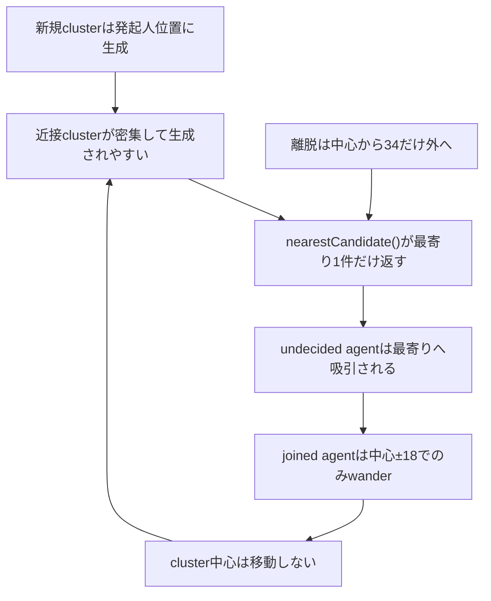
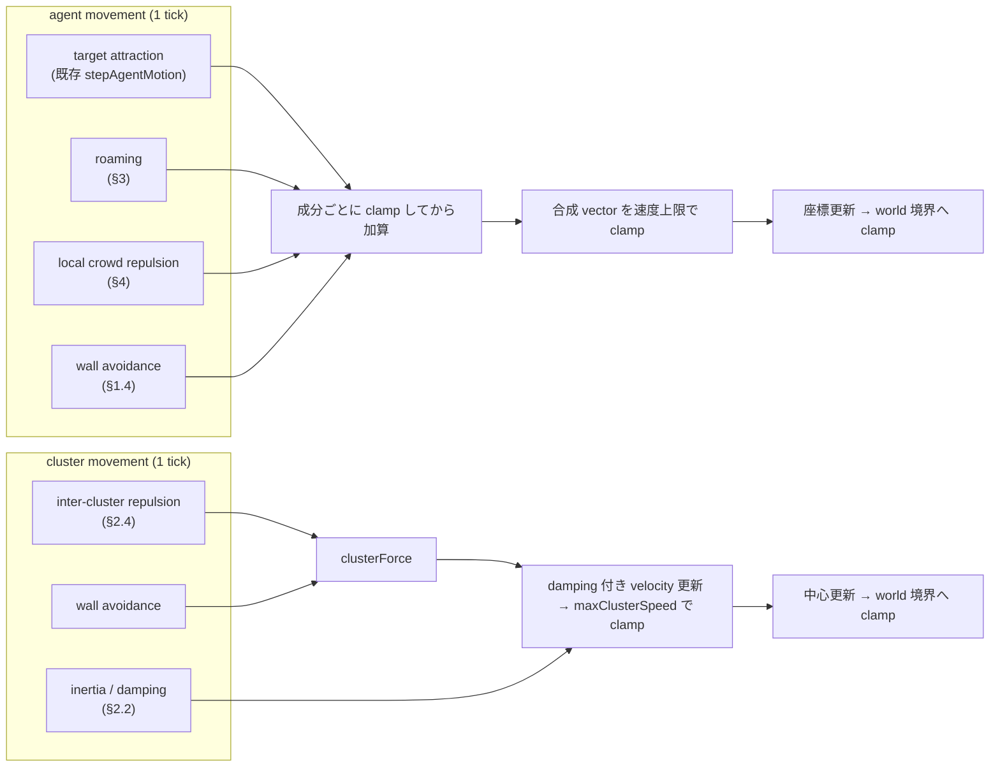
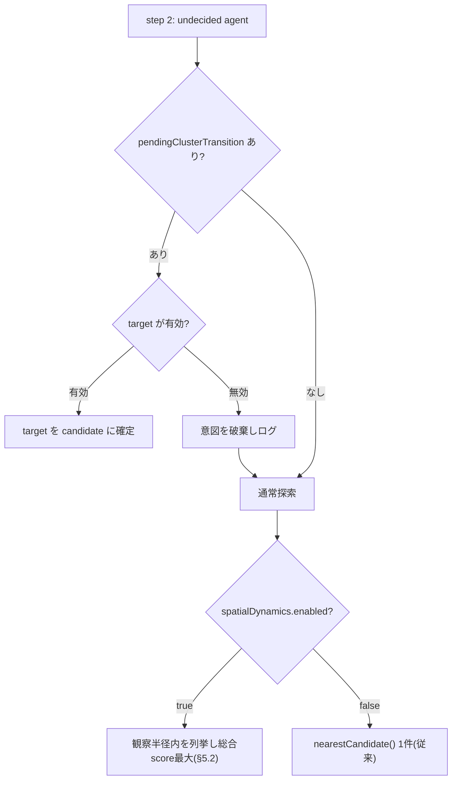
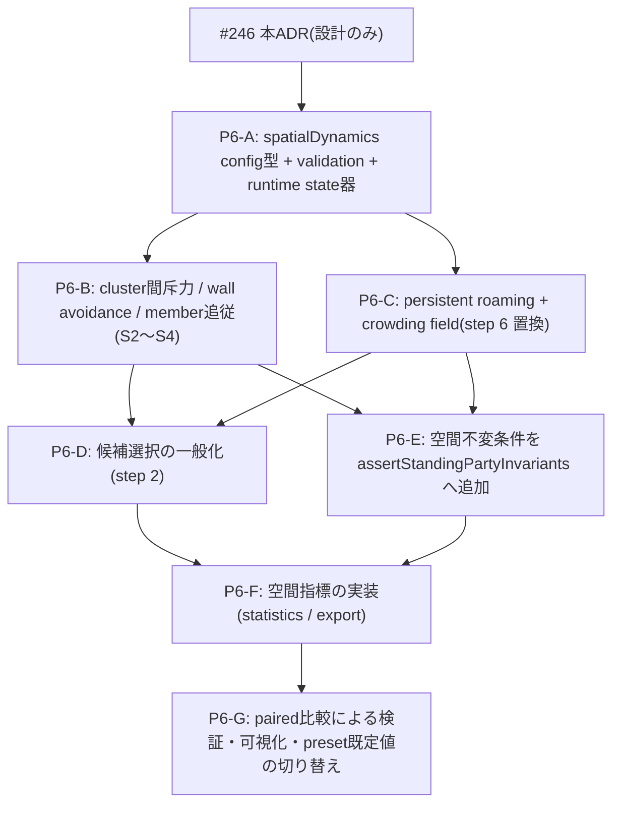

# 立食パーティーの空間回遊・分散ダイナミクス契約 (Issue #246, standing-party Phase 6 設計)

Parent Roadmap: #172。Depends on: #235。Blocks: Phase 6のcluster空間移動、agent回遊、混雑回避、
候補選択一般化、可視化・検証。

この文書は、立食パーティー(`standingParty`)の空間力学 ―― cluster間斥力、未所属agentのpersistent
roaming、局所crowding avoidance、wall avoidance、候補選択の一般化 ―― を追加するための
**ドメイン契約(ADR)**である。本Issueの成果物は設計文書のみであり、`engine.ts`、`SimulationState`、
`Agent`、`GroupCandidate`、既存の状態・event・PRNG消費順は変更しない。型とruntimeの実装は
後続Issueが本契約に従って段階的に行う(§12)。

> **Phase名の注意**: 本文書の Phase 6 は Roadmap #172 の「空間回遊・分散ダイナミクス」を指す。
> Roadmap #61 の speech Phase 3/4(`speechEffects` / `socialExpression` / `speechTrust` /
> `relationshipTie`)とは別の番号体系である。

---

## 0. 決定要約

1. 「輪へ集まる力(social attraction)」と「会場を広く使う力(spatial dispersion)」を別要因として
   定義し、既存の社会的判断式(`attractiveness()`、離脱hazard、`AlternativeClusterInterest`)へ
   空間項を混ぜ込まない。空間力はあくまで**移動vector**と**候補選択のscore項**として表現する。
2. agent movementは `target attraction + roaming + local crowd repulsion + wall avoidance` の
   4成分の加重和とし、**成分ごとにclamp → 加算 → 合成vectorを速度上限でclamp**という固定順序で
   合成する(§1.4)。速度上限は既存`APPROACH_SPEED = 14`を超えない。
3. cluster movementは `inter-cluster repulsion + wall avoidance + inertia/damping` の3成分とし、
   **cluster自身のランダムwanderは採用しない**(§2.5)。cluster中心は社会的実体ではなく
   memberの居場所の要約であり、独立した意思を持たせない。
4. cluster間斥力は**有限range・距離0安全・1tick最大移動量制限・damping付き**とし、
   `forming`は対象に**含めない**(`confirmed`のみ)。`dissolving`/`dissolved`/`expired`も対象外(§2)。
5. persistent roamingは`undecided`(再探索中を含む)のみに適用し、`socialCirculationTendency`は
   **意味を変えず**「離脱しやすさ」のままで、roaming強度へは**別係数として読み取り専用で再利用**する
   (§3.2)。`isObserverJoiner`はboolean分岐として空間式へ入力しない(§3.5)。
6. crowding fieldは**方向サンプリング方式**(agent周囲を`K`方向へ扇形サンプリングし、距離重み付き
   密度が最小の方向へ押す)を採用する。occupancy gridはcell境界の不連続を避けるため採用しない(§4)。
   UI描画gridはruntime入力にしない。
7. 候補選択は「観察半径内の候補列挙 → 総合score最大」(案1)を採用し、softmax/weighted choice(案2)は
   採用しない(§5.3)。探索継続(案3)は「score上位候補が閾値未満なら候補なし=roaming継続」という
   決定的な形で案1へ内包する。**pending targeted transitionのtarget優先契約は変更しない**。
8. tick更新順序は、既存step 1〜9の**前**に空間phase(cluster force → cluster center移動 → member
   位置補正)を置き、**同一tick内でagentが参照するcluster座標はtick開始時スナップショットに固定**する
   (§6)。Phase 5の内容発話・伝播は従来どおり全ての位置更新の後段で走る。
9. 空間座標の不変条件(finite、境界内、1tick最大移動量、joined agentのcluster中心からの最大乖離、
   teleport禁止、完全重複時の決定的分離)を`standingPartyInvariants.ts`へ追加する(§7)。
10. Exit Criteriaは「見た目が広がった」ではなく、spatial coverage / radius of gyration /
    cluster nearest-neighbor distance / local density分布 / 重複時間率 / zone訪問数 / roaming移動距離の
    定量指標で判定する(§8)。指標は社交性・人気等の価値評価と結びつけない。
11. `StandingPartyScenarioConfig.spatialDynamics`という独立configを追加し、`enabled: false`(既定)の
    間はPhase 5までのstate・event・PRNG系列をbyte-identicalに保つ。`afterParty`/`classroomPair`では
    `formationPolicy.id`ゲートにより一切実行しない(§9)。
12. 会場anchor(ドリンク・料理・入口・窓際)は本Phaseの対象外。ただしagent movementの合成境界を
    「名前付きvector成分の加算」として定義し、将来`anchor attraction`を第5成分として追加できる形にする(§10)。

---

## 1. 現状との境界

### 1.1 現行の空間挙動(Phase 5時点)

`engine.ts`の現行実装が持つ空間的性質は次のとおり。本Phaseはこれらを**置き換える**のではなく、
**新しい成分を加えたうえで既存成分を合成の1項として位置づけ直す**。

| 現行の挙動 | 実装位置 | Phase 6での扱い |
| --- | --- | --- |
| 新規clusterは発起人の現在位置に作られる(`x: agent.x, y: agent.y`) | step 1 (核形成) | 変更しない。ただし直後のcluster斥力phaseが過密な初期配置を緩和する |
| 近接forming候補への併合(`candidateMergeRadius`) | step 1 | 変更しない(斥力対象を`confirmed`のみにする理由の1つ、§2.3) |
| 通常再探索は`nearestCandidate()`で最寄り1件を選び、その1件のattractivenessだけ評価する | step 2 | §5の候補列挙型selectorへ一般化する(feature ON時のみ) |
| `pendingClusterTransition`のtargetは`nearestCandidate()`より優先される | step 2 / step 3 | **変更しない**(§5.5の優先順位契約) |
| approaching agentは`stepAgentMotion(agent, candidate)`で毎tick`APPROACH_SPEED = 14`だけ直進する | step 3 | target attraction成分として合成へ組み込む(§1.2) |
| forming clusterの中心が`rng.range(-2, 2)`で微調整される | step 4 | 変更しない(forming期の微振動。斥力とは別物) |
| joined agentはcluster中心±18の点へ`WANDER_SPEED = 0.5`で寄る | step 5 | member追従(§2.6)の基礎としてそのまま使う |
| undecided agentは毎tick`±WANDER_SPEED`の独立ランダムwalk | step 6 | persistent roaming(§3)へ置き換える(feature ON時のみ) |
| 離脱時は中心から`CLUSTER_DEPARTURE_STEP_DISTANCE = 34`だけ外へ1回移動する | `departFromCluster` | 変更しない。以降の吸い戻りはroaming/crowdingとcooldownで緩和する |
| confirmed clusterの中心は**一切移動しない** | ― | §2のcluster movementを新設する |

会場は`WORLD_WIDTH = 800` × `WORLD_HEIGHT = 520`、agent座標のclamp範囲は`[5, W-5] × [5, H-5]`、
cluster中心のclamp範囲は`[20, W-20] × [20, H-20]`(step 4のforming微調整)である。Phase 6でも
この2つの境界定義を変更しない。

### 1.2 局所固定が起きる因果



閉ループの要点は「**cluster中心が動かない**」×「**最寄り1件しか見ない**」×「**未所属の移動が
無方向のランダムwalk**」の3点であり、Phase 6はこの3点それぞれに対応する成分
(§2 cluster movement / §5 候補選択一般化 / §3 persistent roaming)を導入する。

### 1.3 既存概念との意味の違い(混同してはならない)

| 概念 | 既存の意味 | Phase 6が**しない**こと |
| --- | --- | --- |
| `socialCirculationTendency`(#188) | 会話に不満がなくても次の輪へ移りやすい、離脱側の安定特性 | 「歩き回る速さ」へ意味変更しない。roamingの補助係数として読むが、離脱hazardの式は変えない |
| `AlternativeClusterInterest`(#198) | **joined agentが他clusterへ関心を持つ**評価。毎tick導出・非保存 | undecided agentの候補選択をこの型で置き換えない(§5.2で成分だけ共有する) |
| `ClusterTransitionDecision`(#200) | stay / departAndExplore / switchToTargetClusterの合成decision | 空間項をこのdecisionのhazardへ加算しない |
| Phase 5 information seeking(#233) | 話題・情報の観点でclusterを評価するdecision入力 | 「情報がありそうな方向へ歩く」という空間的探索へ拡張しない(本Phase対象外) |
| speech `range` / `audibility`(#204〜) | 発言が届く距離 | crowding fieldの密度計算へ流用しない(発話の到達と混雑は別物) |
| Phase 4 contact network | 事後の観察用read model | 移動decisionの入力にしない(Phase 5と同じ一方向境界) |

**social circulation / alternative interest / information seekingは「どの輪を選ぶか」の社会的評価であり、
Phase 6の空間力は「どこを歩くか」の物理的配分である。** 前者は候補選択score(§5)を通じてのみ後者と
接続し、逆方向(空間力が社会的評価値そのものを書き換える)は禁止する。

### 1.4 agent movement vectorの責務図と合成順序



合成は**必ず次の順序**で行う。順序を変えると、成分ごとの上限が実質的に無効になったり、
境界clampが最大移動量の検査(SP-4)より後に効いたりして不変条件が崩れる。

```text
1. 各成分を個別に計算し、成分ごとの上限で clamp する
     target  = targetAttraction(agent)                       // 上限 APPROACH_SPEED
     roam    = clamp(roamingVector(agent),  roamingSpeed)
     crowd   = clamp(crowdVector(agent),    crowd.maxContribution)
     wall    = clamp(wallVector(agent),     wall.maxContribution)
2. 加算する
     raw = target + roam + crowd + wall
3. 合成 vector を速度上限で clamp する
     v = clamp(raw, maxAgentSpeed)            // maxAgentSpeed <= APPROACH_SPEED * 1.2
4. 座標を更新し、world 境界へ clamp する
     position = clampToWorld(position + v)
```

- 状態ごとの成分の有無:

| state | target attraction | roaming | crowd repulsion | wall avoidance |
| --- | --- | --- | --- | --- |
| `undecided` | なし | **あり** | あり | あり |
| `approaching` | あり(既存) | なし | あり(弱、`crowd.maxContribution`は共通) | あり |
| `forming` | なし(既存の中心微調整のみ) | なし | なし | なし |
| `joined` | あり(既存の±18 wander) | なし | あり(自クラスタmemberを除外、§4.3) | あり |
| `leaving` | あり(退場方向、既存) | なし | なし | なし |

- wall avoidance(agent側)は、境界から`wall.margin`(既定案`40`)以内にいるとき会場内側へ
  `wall.strength * (1 - d / wall.margin)`の寄与を与える。既存の`clamp`による硬い境界は**残したまま**、
  その手前で滑らかに押し戻す層を1枚足す形にする。角(2辺が同時に近い)では両軸の寄与が加算され、
  対角方向へ押し返される。
- `approaching`にroamingを与えないのは、目的地が決まっている移動を揺らさないため(§3.4)。
  `forming`に空間力を与えないのは、既存step 4の中心微調整と競合させないため(§2.3と同じ理由)。


---

## 2. cluster空間力学

### 2.1 責務

cluster中心は「そこに会話の輪がある」という位置の要約であり、独立した意思を持つ主体ではない。
したがってcluster movementの目的は次の2つに限定する。

1. 近すぎるcluster同士が視覚的・意味的に融合して見えるのを避ける(inter-cluster repulsion)
2. 壁・角に貼り付いたclusterを会場内側へ戻す(wall avoidance)

### 2.2 合成式

```text
clusterForce(c) = repulsion(c) + wallAvoidance(c)
clusterVelocity(c, t) = clamp(
    damping * clusterVelocity(c, t-1) + clusterForce(c),
    maxClusterSpeed)
clusterCenter(c, t) = clampToWorld(clusterCenter(c, t-1) + clusterVelocity(c, t))
```

- `damping ∈ [0, 1)`(既定案`0.6`)により、押し合いが振動として持続しない。
- `maxClusterSpeed`(既定案`2.0`、`WANDER_SPEED`より大きく`APPROACH_SPEED`より十分小さい)は
  1tickの最大中心移動量そのものである。§7の不変条件が同じ値で検査する。
- `clusterVelocity`は`SimulationState`のspatial runtime state(§9.2)に持つ。`Agent`/`GroupCandidate`へ
  新規fieldを増やさない方針は`InterventionRuntimeState`(#156)と同じ。

### 2.3 斥力対象の決定

| status | 斥力対象 | 理由 |
| --- | --- | --- |
| `confirmed` | **含める** | 成立した輪同士が近接し続けるのが局所固定の主因 |
| `forming` | **含めない** | step 1の`candidateMergeRadius`による併合と競合する。「近づいたら1つになる」形成期の意味を斥力が壊す |
| `dissolving` / `dissolved` / `expired` | 含めない | フェードアウト表示用の残骸であり、位置に意味がない |

斥力は**押される側・押す側の両方がconfirmed**である対のみに働く。confirmed cluster数は通常
一桁台であり、O(cluster²)の総当たりで十分である(agent数に対する二乗ではない)。

### 2.4 斥力の形

```text
d = distance(c1.center, c2.center)
if d >= repulsionRadius: contribution = 0            // 有限range
u = (d > epsilon) ? (c1.center - c2.center) / d      // 単位方向
  : deterministicSeparationDirection(c1.id, c2.id)   // 完全重複時のfallback
magnitude = repulsionStrength * (1 - d / repulsionRadius)   // 線形減衰(d→0でも有限)
```

- `repulsionRadius`(既定案`120`)を超えれば寄与は厳密に`0`になり、遠方clusterは互いに影響しない。
- `d`が`epsilon = 1e-6`未満のときは`deterministicSeparationDirection`を使う。これは
  `hashString(\`${c1.id}:${c2.id}\`)`から角度を導く**rng非消費・決定的**な関数とし、
  `id`の辞書順で正規化して対称性(互いに逆向き)を保証する。ゼロ除算・NaN・Infinityは発生しない。
- 減衰は`1/d²`ではなく線形にする。距離0近傍で発散しないことを式の形で保証するためであり、
  物理的な正確さは目的ではない。
- hysteresis: `repulsionRadius`に対し、寄与が立ち上がる距離を`repulsionRadius`、
  完全に消える距離を`repulsionRadius * (1 + hysteresisMargin)`(既定案`0.1`)とし、
  境界付近でON/OFFが毎tick反転しないようにする。dampingと合わせて振動を二重に抑える。

### 2.5 cluster自身のwanderを採用しない理由

| 案 | 内容 | 判定 |
| --- | --- | --- |
| A: cluster中心にランダムwanderを付ける | 中心が毎tick小さくランダム移動する | **不採用**。rng消費が増え、seed再現性の検証面積が広がる割に、局所固定の原因(§1.2の閉ループ)を解かない |
| B: memberの平均移動意図から中心が緩やかに移る | memberのroaming/crowding意図の平均をcluster forceへ加える | **不採用(本Phase)**。memberは中心へ追従しているため平均意図はほぼ0になり、意味のある移動を生まない。将来anchor attraction(§10)が入った時点で再検討する |
| C: 斥力とwall avoidanceのみ | 決定的な力のみで動く | **採用**。rngを一切消費せず、Exit Criteria(§8)への寄与が説明可能 |

**cluster movementはrngを消費しない。** これによりfeature ON/OFFでcluster移動そのものが
主系列PRNGの draw 列を変えることはない(§9.3)。

### 2.6 member追従と位置補正

cluster中心が動いた分、memberを機械的に平行移動させることは**しない**(teleport禁止、§7)。
代わりに次の弱い補正だけを行う。

```text
for each agent with state === "joined" and joinedGroupId === c.id:
    offset = agent.position - clusterCenterBefore(c)
    desired = clusterCenterAfter(c) + offset          // 相対配置を保った理想位置
    agent.position += clamp(desired - agent.position, maxMemberFollowStep)
```

- `maxMemberFollowStep`(既定案`maxClusterSpeed`と同値=`2.0`)により、memberは中心と同じ速さまでしか
  引っ張られない。中心が最大速度で動いてもmemberが置き去りにならず、かつ瞬間移動もしない。
- 既存step 5の`±18`のwanderはこの補正の**後**に従来どおり実行する。順序を固定することで、
  「追従で相対配置が保たれ、その上に既存のゆらぎが乗る」という意味づけが一意になる。
- `joined`以外(`approaching`含む)には追従補正を適用しない。approaching agentのtargetは
  §6.3のスナップショット規約で保護する。

---

## 3. persistent roaming

### 3.1 責務と適用範囲

roamingは「行き先が決まっていない人が、会場内を目的を持って歩いている」ことの表現である。
適用対象は`state === "undecided"`のagentのみ(離脱直後の再探索中を含む)。
`approaching`/`forming`/`joined`/`leaving`には適用しない。

### 3.2 heading保持モデル

毎tick独立のランダムwalkは、期待変位が0になり「その場で震える」表現にしかならない。代わりに
**一定期間維持されるheading(向き)**を持たせる。

```text
RoamingState = { headingRadians: number, expiresAtTick: number }
```

- headingは`headingHoldTicks`(既定案 8〜20 tickの範囲から派生rngで決定)の間維持される。
- 期限が切れたtickで、`headingRadians += noise`(既定案`±headingNoiseRadians = ±0.9 rad`)として
  更新する。全方位への再抽選ではなく前回headingからの摂動にすることで、軌跡が滑らかになる。
- roaming速度は`roamingSpeed * roamingIntensity(agent)`。`roamingSpeed`の既定案は`3.0`
  (`WANDER_SPEED = 0.5`より大きく`APPROACH_SPEED = 14`より十分小さい)。

### 3.3 `socialCirculationTendency`の再利用範囲

```text
roamingIntensity(agent) =
    roamingIntensityBase
  + circulationRoamingWeight * (agent.socialCirculationTendency ?? 0.5)
```

- **`socialCirculationTendency`の定義・分布・離脱hazardでの使われ方は変更しない**(#188のまま)。
  Phase 6はこの値を**読むだけ**の補助係数として使う。
- `circulationRoamingWeight = 0`(既定案では`> 0`だが、config上0にできる)にすれば、
  roamingは全agent一様になる。意味の結合度をconfigで下げられる形にしておく。
- 未設定(テストが直接`Agent`を構築する場合等)は既存慣習どおり`0.5`へフォールバックする。

### 3.4 target確定時のroaming減衰

| 状況 | roamingの扱い |
| --- | --- |
| target候補なし(§5でscore閾値未満) | 全強度で適用 |
| このtickでtarget候補を選び`approaching`になった | 次tick以降は`approaching`のため適用対象外 |
| `pendingClusterTransition`を持つ | **roaming寄与を0にする**(targetへの移動意図を最優先する既存契約、§5.5) |
| 離脱直後のcooldown中 | 全強度で適用(離脱元への吸い戻りを弱める主目的の区間) |

### 3.5 ObserverJoinerの扱い

`isObserverJoiner`は**空間式のどの項にも入力しない**。ObserverJoinerらしい回遊(輪の周辺で
様子見をし続ける)は、既存の`influenceAvoidance`が候補選択score(§5.4)へ与える効果と、
roamingが等しく適用される結果として**創発**させる。booleanで分岐した専用挙動を作らない方針は
#197 ADRの`conflictIntensity`と同じである。

---

## 4. 局所crowding field

### 4.1 方式の比較と採用

| 案 | 決定性 | 連続性 | 計算量 | 判定 |
| --- | --- | --- | --- | --- |
| 方向サンプリング(周囲`K`方向の距離重み密度) | 世界座標から決定的 | 方向解像度に応じて連続 | O(agent × 近傍agent) | **採用** |
| 粗いoccupancy grid | 決定的 | **cell境界で不連続** | O(agent) | 不採用(境界振動の懸念、要件4) |
| kernel density(全agent対象) | 決定的 | 連続 | O(agent²)が毎tick | 不採用(計算量) |

### 4.2 採用案の定義

```text
for k in 0..K-1:                                  // K = crowdSampleDirections(既定案 8)
    dir_k = 2π k / K
    density_k = Σ over neighbors n within crowdSampleRadius:
        w_distance(|n - a|) * w_angle(angleBetween(dir_k, n - a))
push = -Σ_k density_k * unit(dir_k)               // 密度の重み付き逆方向
crowdVector = clamp(push * crowdRepulsionStrength, crowdMaxContribution)
```

- `w_distance(d) = 1 - d / crowdSampleRadius`(既定案`crowdSampleRadius = 70`)。範囲外は0。
- `w_angle(θ) = max(0, cos θ)`。方向間で重みが滑らかに配分され、agentが方向binの境界を跨いでも
  `crowdVector`は連続的に変化する(gridのcell境界問題が起きない)。
- 近傍探索は`crowdSampleRadius`による事前フィルタで済ませる。会場規模(800×520)とagent数
  (数十)では、素直な二重ループでも1tickあたりのコストは既存の`dominantClique`等と同オーダーであり、
  空間indexの導入は本Phaseでは行わない(必要になった時点で別Issue)。
- rngを一切消費しない。

### 4.3 自クラスタmemberの除外

| 対象 | 密度に数えるか | 理由 |
| --- | --- | --- |
| 自分自身 | 数えない | 自明 |
| 同じclusterのmember | **数えない** | 会話の輪は「近くにいるのが正しい」状態であり、これを混雑として押し返すと輪が崩壊する |
| 他clusterのmember | 数える | 隣の輪との過密は避けたい対象そのもの |
| undecided / approaching のagent | 数える | 通路の混雑 |
| `leaving` / `left` のagent | 数えない | 退場中の一時的な位置に反応させない |
| cluster中心そのもの | **数える**(重み`clusterCenterCrowdWeight`、既定案`1.5`) | 輪は点ではなく面を占めるため、member座標だけでは輪の存在感を過小評価する |

`joined`なagentにもcrowd repulsionは適用するが、上記の除外により**自分の輪からは押し出されない**。
これにより「輪の中では落ち着いているが、隣の輪が近づきすぎると少しずれる」という挙動になる。

---

## 5. cluster候補選択の一般化

### 5.1 現状の問題

step 2は`nearestCandidate()`で**最寄り1件**を選び、その1件だけを`attractiveness()`にかける。
つまり「最寄りが魅力的でなければ、そのtickは何もしない」という構造であり、
少し遠い魅力的な輪は永久に選ばれない。これがagentを局所へ縛る主因である。

### 5.2 採用案: 観察半径内の候補列挙 + 総合score最大

```text
observed = candidates
    .filter(isJoinable(c, capacityOf(c)))
    .filter(distance(agent, c) <= spatialObservationRadius)
    .filter(not in cooldownExcludeIds)
    .sortBy(distance)                      // 決定的
    .take(maxObservedCandidates)           // 上限(既定案 12)
best = argmax over observed of candidateScore(agent, c)
if best === undefined or candidateScore(best) < minCandidateScore:
    → 候補なし(roaming継続)
```

- 列挙・切り捨て・argmaxはすべて決定的(距離昇順、同値は`candidate.id`昇順)。**rngを消費しない。**
- `maxObservedCandidates`は`AlternativeClusterInterestConfig.maxTrackedCandidates`(20)と同じ
  「上限で切り捨てる」方針に揃える。
- feature OFF時は従来の`nearestCandidate()`経路をそのまま使う(§9)。

### 5.3 案2 / 案3を採用しない・内包する理由

| 案 | 判定 | 理由 |
| --- | --- | --- |
| 案2: distance減衰付きsoftmax / weighted choice | **不採用** | 候補選択に新しいrng drawが入り、feature ON/OFFで主系列PRNGの消費列が変わる。§9.3のbyte-identical要件を満たすには「OFF時のみdrawしない」分岐が必要になり、既存step 2の`rng.chance(approachProbability)`との順序関係も複雑化する。多様性は案1のscore項(§5.4)とroaming(§3)で十分に得られる |
| 案3: 一定確率で探索を継続する | **決定的な形で内包** | 「確率で見送る」のではなく「score上位が`minCandidateScore`未満なら候補なし」とする。結果として探索は継続するが、rngを増やさない。既存の`rng.chance(approachProbability)`による見送りは**そのまま残る**ため、確率的な様子見の表現は失われない |

### 5.4 総合scoreの構成

```text
candidateScore(agent, c) =
      w_social      * attractiveness(agent, c, ...)          // 既存式そのまま(再実装しない)
    + w_distance    * distanceFactor(agent, c)
    + w_alternative * alternativeInterestFactor(agent, c)     // Phase 3の成分を再利用
    + w_topic       * topicOpportunityFactor(agent, c)        // Phase 5、feature ON時のみ
    + w_exploration * explorationFactor(agent, c)
    - p_cooldown    * recentlyDepartedOrFailedPenalty(agent, c)
    - p_crowding    * localCrowdingPenalty(c)
```

| 項 | 定義 | 出所 |
| --- | --- | --- |
| `attractiveness` | 既存の社会的魅力度(willingness / conformity / influenceAvoidance / clique bonus / outsider penalty / speech effect / tie補正) | `engine.ts`。**式を複製せず呼び出す** |
| `distanceFactor` | `1 - d / spatialObservationRadius`(範囲外は列挙されない) | 新規。`AlternativeClusterInterestConfig.distanceDecayRadius`と同じ形 |
| `alternativeInterestFactor` | 既知member・clique適合等。`deriveAlternativeClusterInterests`の成分を**undecided文脈でも呼べる形に一般化**して共有する | #198。型を新設せず既存関数を再利用する |
| `topicOpportunityFactor` | そのclusterの現在topicと自分の関心の適合。`topicIntegration.enabled === false`のときは常に0 | #233 |
| `explorationFactor` | 「まだ行っていない空間zone(§8.6)にある輪」への小さな加点 | 新規。空間的多様性の主動力 |
| `recentlyDepartedOrFailedPenalty` | 既存cooldownを**score減点としても**表現する。既存の`cooldownExcludeIds`による**除外は残す**(二重防御) | #133 / #176 |
| `localCrowdingPenalty` | 候補周辺の局所密度(§4のfieldを候補位置で評価) | 新規 |

すべての重みは`[0, 1]`のconfigとし、`w_social`を既定で最大にする。**空間項が社会的評価を
上書きしないこと**を重み配分で保証する(Phase 4のtie補正が±0.2にclampされているのと同じ思想)。

### 5.5 pending targeted transitionの優先契約(変更しない)



- targetが有効な限り、総合scoreの計算も比較も**行わない**。#201の契約をそのまま維持する。
- targetが無効化されたtickでは従来どおり通常探索へfallbackし、そのfallback先だけがfeature flagで
  切り替わる。

---

## 6. tick更新順序

### 6.1 Phase 6を含む1tickの順序

```text
 0.  前tick状態のコピー / activeSpeechEffectsの減衰(既存)
 S1. [Phase 6] spatial snapshot 確定
       - clusterCenterBefore[] を固定
       - crowding field の入力となる agent 位置を固定
 S2. [Phase 6] cluster spatial force 計算(斥力 + wall avoidance)
 S3. [Phase 6] cluster center 移動(damping / maxClusterSpeed 適用)
 S4. [Phase 6] joined member の追従補正(maxMemberFollowStep)
 1.  核形成(既存 step 1)
 1b. light-observer-invitation(既存)
 2.  接近判定(既存 step 2 / §5 で候補選択のみ差し替え)
 3.  approaching の移動・到着・join(既存 step 3)
 4.  forming の中心微調整(既存 step 4)
 5.  joined の wander(既存 step 5)
 5b. クラスタ離脱判定(既存)
 6.  [Phase 6] undecided の roaming + crowding + wall avoidance(既存 step 6 を置換)
 7.  ストレス蓄積と leave 判定(既存)
 8.  leaving の退場移動(既存)
 9.  グループ成立 / 解散 / 期限切れ判定(既存)
 T.  speech 生成 → 認知 → 解釈 → 効果登録(Phase 3/4、既存)
 U.  Phase 5 内容発話 → 受信 → 採用 → 記憶 → 再伝達(既存)
```

### 6.2 この順序を選ぶ理由

- **S2〜S4をstep 1の前に置く**: cluster中心の移動を、そのtickの社会的判断より先に確定させる。
  これによりstep 2以降が参照するcluster座標は「このtickの最終座標」であり、tick内で二度変わらない。
- **step 4(forming微調整)はcluster斥力の後**: formingは斥力対象外(§2.3)であり、微調整は
  従来どおりrng消費を伴う。順序を変えるとPRNG系列が変わるため、既存位置を動かさない。
- **step 6でroamingを行う**: 既存step 6(undecidedのランダムwalk)の位置をそのまま使い、
  中身だけをfeature flagで差し替える。step 2の接近判定より後なので、「このtickに接近を決めた人は
  roamingしない」が自然に成立する。
- **T / Uは全ての位置更新の後**: Phase 3〜5は発話時点の位置を参照するため、位置が確定した後段に
  置く既存契約を変更しない。

### 6.3 スナップショット規約

同一tick内でcluster中心が動いた結果、approaching agentのtargetが急変しないよう次を固定する。

1. `clusterCenterBefore`はS1で確定し、S4のmember追従補正**だけ**が参照する。
2. step 2の候補選択・step 3の`stepAgentMotion`は、S3適用**後**の中心を参照する。
   1tickあたりの中心移動は最大`maxClusterSpeed = 2.0`であり、`APPROACH_SPEED = 14`に対して
   十分小さいため、approaching agentの進行方向が反転することはない。
3. crowding fieldの入力agent位置はS1のスナップショットで固定する。step 6のループ内で
   先に処理されたagentの新座標が、後続agentの密度計算へ影響しない(**agents配列順への依存を作らない**)。
4. §7の「1tick最大移動量」検査は、S1のスナップショットと tick 終了時点の座標を比較して行う。

---

## 7. 空間不変条件

`src/simulation/standingPartyInvariants.ts`の`assertStandingPartyInvariants`へ次を追加する
(新しいper-tick検査を各テストで再実装しない、というCLAUDE.mdの方針に従う)。

| # | 不変条件 | 検査方法 |
| --- | --- | --- |
| SP-1 | すべてのagent座標・cluster中心・velocityがfinite | `Number.isFinite` |
| SP-2 | agent座標が`[5, W-5] × [5, H-5]`内(`leaving`の退場移動を除く) | 既存clampと同じ範囲で検査 |
| SP-3 | cluster中心が`[20, W-20] × [20, H-20]`内 | step 4のclamp範囲と同一 |
| SP-4 | 1tickのagent移動量 ≤ `max(APPROACH_SPEED * 1.2, roamingSpeed + crowdMaxContribution + wallMaxContribution)` | tick前後スナップショット比較 |
| SP-5 | 1tickのcluster中心移動量 ≤ `maxClusterSpeed` | 同上 |
| SP-6 | `joined` agentと所属cluster中心の距離 ≤ `maxMemberDistance`(既定案`JOIN_DISTANCE * 2 = 52`) | 逸脱時はそのtickの追従補正が不足している証拠 |
| SP-7 | approaching agentのtarget座標変化が`maxClusterSpeed`以下(teleportしない) | target clusterの中心差分 |
| SP-8 | cluster中心が完全重複しても次tickで距離 > 0 になる | `deterministicSeparationDirection`の効果 |
| SP-9 | 空間更新がmembership / pendingClusterTransition / conversation episodeを変更しない | 空間phase前後のID集合比較 |

SP-9は本Phaseの最も重要な境界である。**空間phaseはagent/clusterの座標とvelocityしか書き換えない。**
`state`、`joinedGroupId`、`memberIds`、`currentEpisode`、`pendingClusterTransition`を一切触らない。

---

## 8. 空間指標(Exit Criteria候補)

すべて`standingPartyStatistics.ts`の既存慣習(`summarizeDistribution` / `rateWithDenominator`)に
従い、**分母を明示した記述統計**として定義する。価値評価(社交性・人気・成功)とは結びつけない。

| 指標 | 定義 | 分母 |
| --- | --- | --- |
| 8.1 spatial coverage | 会場を`gridCols × gridRows`(既定案 8×5、**計測専用**)へ分割し、そのtickに1人以上が居るcellの比率 | 全cell数 |
| 8.2 radius of gyration | 全agent位置の重心からの距離のRMS | 在場agent数 |
| 8.3 cluster nearest-neighbor distance | 各confirmed clusterの最近接cluster中心距離の分布(median / p90) | confirmed cluster数 |
| 8.4 local density distribution | 各agentの`crowdSampleRadius`内の他agent数の分布(median / p90) | 在場agent数 |
| 8.5 cluster overlap rate | 中心間距離が`clusterOverlapThreshold`(既定案`60`)未満のcluster対が存在したtickの比率 | 観測tick数 |
| 8.6 distinct zones visited | agentごとに、8.1と同じgridで訪問した**異なるcell数** | agent × run |
| 8.7 roaming distance | `undecided`区間中の累積移動距離 | undecided tick数(単位tickあたりに正規化) |

- 8.1と8.6のgridは**計測専用**であり、§4のcrowding fieldはこのgridを使わない(要件4「UI描画gridを
  runtime入力にしない」の統計側の対応)。
- Exit Criteriaの数値目標(例: coverage中央値がbaselineの1.3倍以上、8.5が10%未満)は、
  実装Issueがbaseline計測後に確定する。本ADRは**指標の定義と、比較が同一seed集合のpairedで行われること**
  だけを固定する(`docs/speech-effects-paired-monte-carlo.md`と同じ方式)。

---

## 9. feature flagと既存互換

### 9.1 config

```ts
// StandingPartyScenarioConfig へ追加(SimParams へは追加しない)
spatialDynamics: SpatialDynamicsConfig;

type SpatialDynamicsConfig = {
  enabled: boolean;                    // 既定 false
  cluster: {
    repulsionRadius: number;           // > 0
    repulsionStrength: number;         // >= 0
    hysteresisMargin: number;          // [0, 1]
    damping: number;                   // [0, 1)
    maxClusterSpeed: number;           // > 0, <= APPROACH_SPEED
    maxMemberFollowStep: number;       // > 0, <= maxClusterSpeed
    overlapThreshold: number;          // > 0(指標 8.5 用)
  };
  roaming: {
    speed: number;                     // > 0, < APPROACH_SPEED
    headingHoldTicksMin: number;       // 正整数
    headingHoldTicksMax: number;       // >= min
    headingNoiseRadians: number;       // [0, π]
    intensityBase: number;             // [0, 1]
    circulationWeight: number;         // [0, 1](0 で socialCirculationTendency と無関係になる)
  };
  crowding: {
    sampleRadius: number;              // > 0
    sampleDirections: number;          // 正整数(既定 8)
    repulsionStrength: number;         // >= 0
    maxContribution: number;           // > 0
    clusterCenterWeight: number;       // >= 0
  };
  wall: {
    margin: number;                    // > 0(この距離以内で効き始める)
    strength: number;                  // >= 0
    maxContribution: number;           // > 0
  };
  candidateSelection: {
    observationRadius: number;         // > 0
    maxObservedCandidates: number;     // 正整数
    minCandidateScore: number;         // [0, 1]
    socialWeight: number;              // [0, 1]
    distanceWeight: number;            // [0, 1]
    alternativeInterestWeight: number; // [0, 1]
    topicOpportunityWeight: number;    // [0, 1]
    explorationWeight: number;         // [0, 1]
    cooldownPenalty: number;           // [0, 1]
    crowdingPenalty: number;           // [0, 1]
  };
};
```

`validateSpatialDynamicsConfig`は既存の`validateAlternativeClusterInterestConfig`等と同じく、
NaN / Infinity / 範囲外 / `min > max` / `maxMemberFollowStep > maxClusterSpeed` /
`maxClusterSpeed > APPROACH_SPEED`を**domain layerで**拒否する。UI側の入力検証に依存しない。

### 9.2 runtime state

```ts
// SimulationState へ追加(Agent / GroupCandidate へは field を増やさない)
spatialRuntimeState?: {
  clusterVelocity: Record<string, { vx: number; vy: number }>;   // clusterId -> velocity
  roaming: Record<string, { headingRadians: number; expiresAtTick: number }>; // agentId -> heading
  visitedZones?: Record<string, number[]>;                        // 指標 8.6 用(計測 ON 時のみ)
};
```

- `interventionRuntimeState`(#156)/`informationRuntime`(#229)と同じ「tick間のfall back」パターンに
  従い、呼び出し側が毎tick渡し忘れても直前の値を引き継ぐ。
- disabled中は`undefined`のまま。record shapeのruntime stateで「空」と「未使用」を区別する既存方針を踏襲。
- 消滅したclusterのvelocity、`left`したagentのroaming stateは、対応するentityの除去と同じtickに
  削除する(孤児entryを残さない。`assertStandingPartyInvariants`で検査する)。

### 9.3 RNG消費方針

| 成分 | rng消費 | 系列 |
| --- | --- | --- |
| cluster斥力 / wall avoidance / member追従 | **なし** | ― |
| crowding field | **なし** | ― |
| 候補列挙・総合score・argmax | **なし** | ― |
| roamingのheading初期化・更新 | あり | **主系列と独立の派生stream** |

roamingのrngは`createSpatialRandom(runSeed, "roaming", agentId, tick)`として
`hashString([runSeed, "spatialDynamics", stage, ...parts].join(":"))`から派生させる。これは
`schoolInterventionRuntime.ts`の`createInterventionRandom`、`informationState.ts`の
`createInformationRandom`と同じ方式である。

**結果として、`enabled: false`のときはもちろん、`enabled: true`のときも主系列`SeededRandom`の
draw列は変わらない。** 変わるのは「その draw が比較される閾値」と「agentが居る座標」だけであり、
Phase 3のspeech effectsが確立した契約と同型である。

ただし座標が変われば`nearestCandidate`/`attractiveness`の結果が変わるため、
**同一seedでの軌跡は`enabled: true`と`false`で当然異なる**。byte-identicalを保証するのは
`enabled: false`の場合のみである。

### 9.4 既存シナリオ非介入

- 空間phase(S1〜S4)、roaming置換(step 6)、候補選択一般化(step 2)はいずれも
  `formationPolicy.id === "standingParty" && standingPartyConfig.spatialDynamics.enabled`で
  ゲートする。`afterParty` / `classroomPair`では条件式の評価以外は何も実行しない。
- 既存の`afterPartyRegression.test.ts` / `classroomPairInvariants.test.ts` / `nonInterference.test.ts`が
  そのまま通ることを回帰の一次防衛線とする。

### 9.5 標準presetでの有効化(migration)

1. 実装Issueの間は`enabled: false`が既定。Phase 6専用の比較preset(または詳細設定UI)からのみONにする。
2. §8の指標がbaseline比で改善し、かつ既存のPhase 2〜5受入テスト(preset間コントラスト、
   observerJoiner孤立、長時間安定性)が維持されることを確認する。
3. 確認後、standingParty標準presetの既定値を`enabled: true`へ切り替える。この切り替えは
   **独立した1コミット**とし、config既定値の変更以外を含めない(切り戻しを容易にするため)。
4. `enabled: false`の経路は切り替え後も削除しない(旧挙動の再現とA/B比較に使う)。

---

## 10. 将来の会場anchorとの境界

- ドリンク・料理・入口・窓際等のPOI / anchorは**本Phaseの対象外**。座標も型も導入しない。
- ただしagent movementの合成(§1.4)は「名前付きvector成分の加算」として定義しており、
  将来`anchorAttraction`を第5成分として加えるだけで拡張できる。cluster側も同様に
  `clusterForce`へ成分を1つ足す形で拡張できる。
- 拡張時に破ってはならない契約: 成分ごとのclamp → 加算 → 合成clampの順序(§1.4)、
  rng消費方針(§9.3)、空間phaseがmembershipを触らないこと(SP-9)。
- 物理衝突・NavMesh・経路探索・3D表示・実データ較正は明示的に対象外(Issue本文の「対象外」と同じ)。

---

## 11. 受入条件との対応

| Issue #246 の受入条件 | 本文書での該当箇所 |
| --- | --- |
| cluster間斥力・agent roaming・crowding avoidance・wall avoidanceの責務分離 | §1.4の責務図、§2、§3、§4 |
| social circulation / alternative interest / information seekingとの意味の違い | §1.3の対比表、§3.3、§5.4 |
| candidate選択一般化の採用方針 | §5.2(採用)、§5.3(案2不採用・案3内包) |
| cluster center移動とmember追従の不変条件・最大速度 | §2.2、§2.6、§7 SP-5/SP-6 |
| tick更新順序とPhase 5処理との関係 | §6.1、§6.2、§6.3 |
| spatial coverage等の定量的Exit Criteria候補 | §8 |
| feature disabled時のPhase 5互換と既存scenario非介入 | §9.1、§9.3、§9.4 |
| 将来のvenue anchorを追加可能だが先取りしない境界 | §10 |
| 既存runtimeは本Issueでは変更しない | 本コミットは`docs/`と`README.md`のみを変更する |
| `npm run lint` / `npm run test` / `npm run build` | 変更なしのまま成功する |

---

## 12. 後続Issueの依存関係と実装順



| ステップ | 内容 | 完了時点で観測できるべきこと |
| --- | --- | --- |
| P6-A | config型・validation・`spatialRuntimeState`の器のみ。engineからは参照しない | 既存挙動・PRNG系列がbyte-identical(#198と同じ区切り方) |
| P6-B | cluster斥力・wall avoidance・member追従を`enabled`ゲート付きで結線 | ON時にcluster nearest-neighbor distance(8.3)が増える |
| P6-C | roaming + crowding fieldでstep 6を置換 | ON時にspatial coverage(8.1)とroaming distance(8.7)が増える |
| P6-D | 候補選択を列挙+総合scoreへ一般化 | ON時にdistinct zones visited(8.6)が増え、`pendingClusterTransition`優先契約のテストが通る |
| P6-E | 空間不変条件の追加 | 長時間runでSP-1〜SP-9が破れない |
| P6-F | 空間指標の実装 | 8.1〜8.7がJSON / CSV exportに出る |
| P6-G | paired比較・E2E・preset既定値切り替え | §9.5の手順でON化し、Phase 2〜5の受入テストが維持される |

P6-Bまたは P6-C のいずれか一方だけをONにしても破綻しないこと(成分が独立に加算されること)は、
§1.4の合成順序が保証する。
